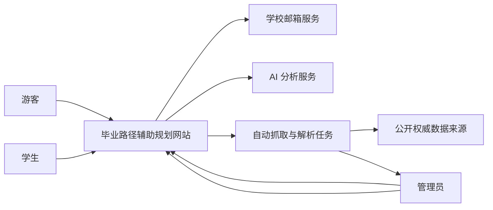
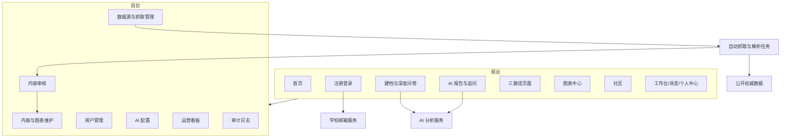
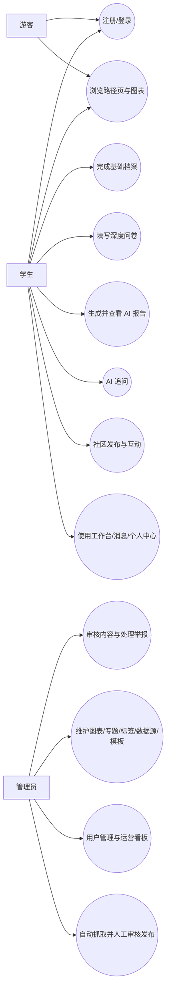
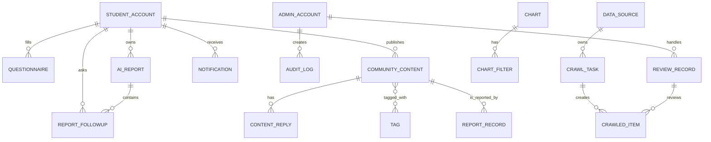
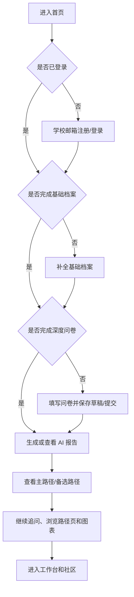
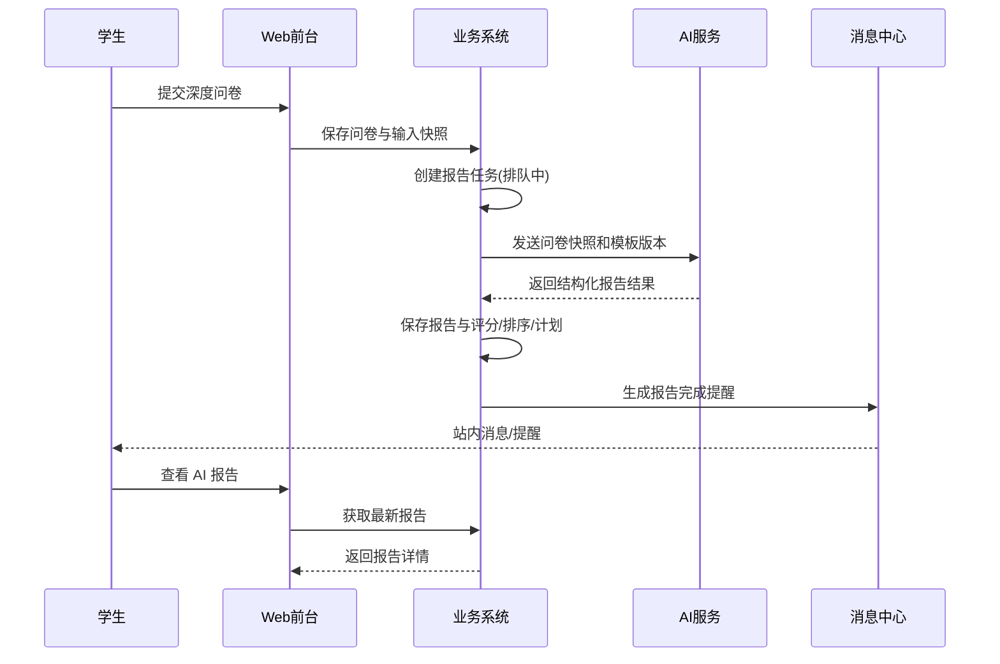
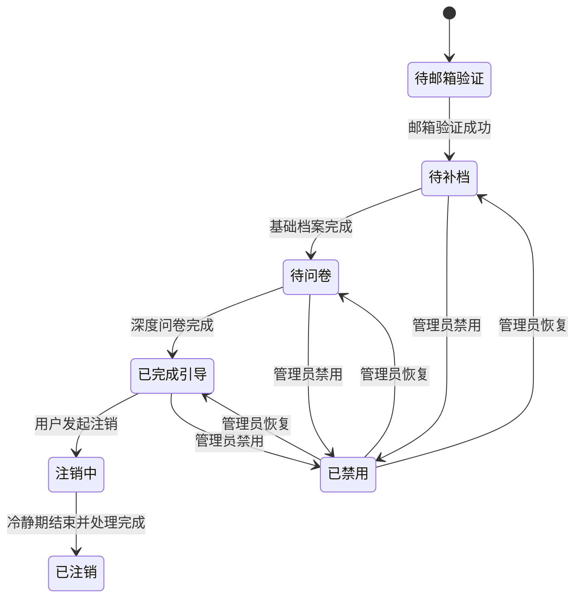
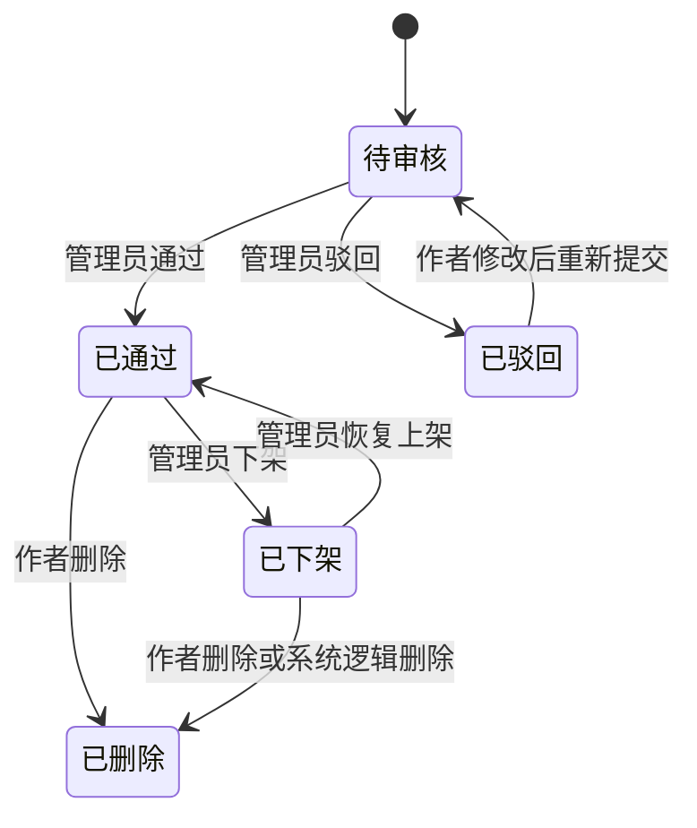
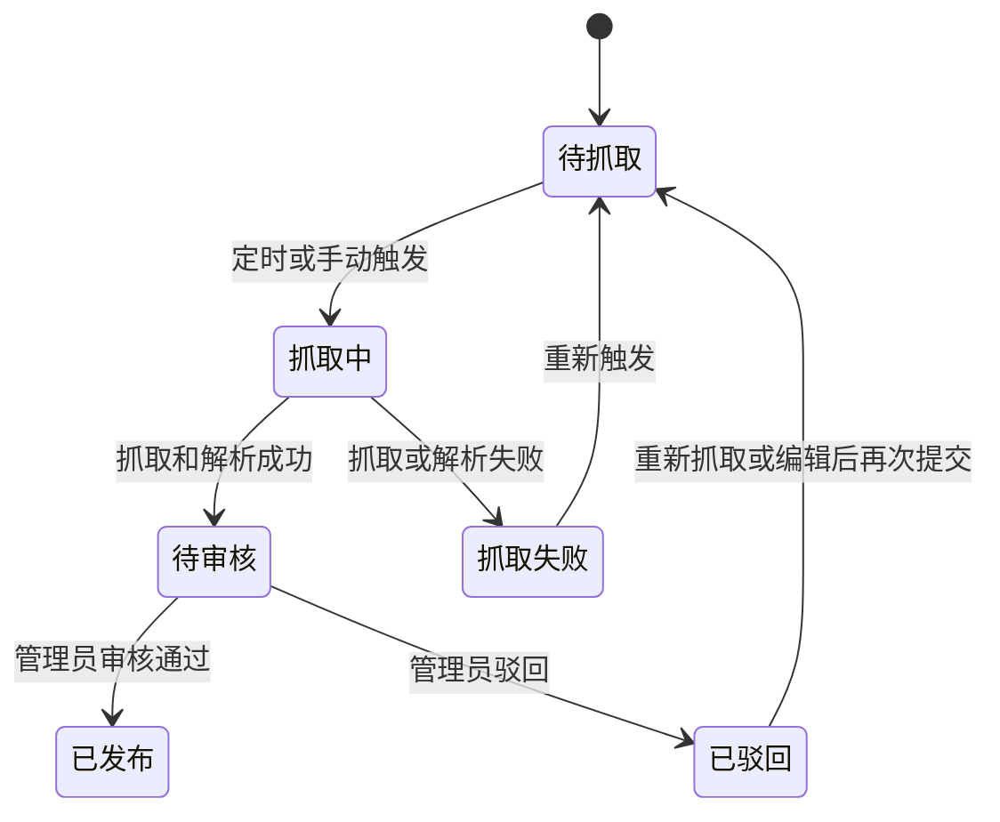

# 毕业路径辅助规划网站 软件需求规格说明书（SRS）V1.1

## 文档控制
| 项目 | 内容 |
| --- | --- |
| 文档编号 | CC-SRS-V1.1-TPL |
| 文档名称 | 毕业路径辅助规划网站软件需求规格说明书 |
| 文档版本 | V1.1 |
| 文档状态 | 新基线待评审冻结 |
| 编制日期 | 2026-04-06 |
| 编制依据 | 《毕业路径辅助规划网站需求基线 V1.1（支持自动抓取与人工审核发布）》 |

## 1 引言

### 1.1 编写目的
本文档用于按照指定章节模板，完整说明“毕业路径辅助规划网站”V1.1 的业务范围、功能需求、性能需求、数据要求、运行环境和接口约束，作为后续概要设计、详细设计、开发、测试和验收的统一依据。

本文档的预期读者包括：
- 项目任务提出方与校方管理人员
- 产品经理与需求分析人员
- UI/UX 设计人员
- 前后端开发工程师
- 测试工程师
- 运维与内容运营人员

### 1.2 背景
#### a. 待开发的软件系统名称
- 中文名称：毕业路径辅助规划网站
- 英文简称：Career Compass

#### b. 项目的提出者、开发者、用户及运行环境
| 项目 | 说明 |
| --- | --- |
| 任务提出者 | 本校与毕业生发展、就业指导、学生事务相关的业务主管部门，具体名称以立项批文为准 |
| 软件开发者 | Career Compass 项目研发组，具体开发单位以立项文件或合同为准 |
| 软件用户 | 本校本科应届毕业生、后台管理员 |
| 软件维护者 | 项目技术维护人员、后台运营与审核人员 |
| 运行网络 | 学校批准使用的校园网与互联网环境 |
| 实现平台 | 校内计算中心服务器或经学校批准的云服务器环境 |

#### c. 与其他系统或机构的相互关系
本系统是一个以 Web 方式提供服务的独立应用系统，但在业务上需要与以下外部对象形成边界清晰的协作关系：
- 学校邮箱服务：用于发送注册验证码、登录验证码和找回密码验证码。
- AI 分析服务：用于生成测评报告与围绕报告的多轮追问回答。
- 公开权威数据来源：用于支撑图表、专题内容和政策摘要，允许系统对已批准的公开权威来源执行自动抓取，但抓取结果必须经人工审核后才能发布。
- 校方管理机构：负责审核内容、确认数据来源和维护平台运营规则。

系统关系示意如下：

### 1.3 定义
| 术语或缩写 | 定义 |
| --- | --- |
| 三路径 | 指考公、考研、就业三类毕业路径 |
| 游客 | 未登录用户，仅可浏览公开信息 |
| 学生 | 已注册且通过学校邮箱验证的前台正式用户 |
| 管理员 | 负责用户管理、内容审核、内容维护和配置维护的后台用户 |
| 基础档案 | 学号、姓名、学院、专业、毕业年份、手机号、昵称、头像、隐私设置等资料 |
| 深度问卷 | 用于生成 AI 报告的结构化测评问卷 |
| AI 报告 | 基于用户输入快照生成的路径分析报告，结论仅供辅助决策 |
| 问卷版本 | 当前正在使用的问卷模板版本编号 |
| 报告模板版本 | 当前用于生成报告的模板版本编号 |
| 提示词模板 | 生成 AI 报告和 AI 追问时使用的提示词规则版本 |
| 自动抓取数据 | 系统从已批准的公开权威来源自动采集并解析得到的候选数据 |
| 待审核发布数据 | 已抓取但未通过管理员审核，暂不可前台展示的数据 |
| FAQ | Frequently Asked Questions，常见问题 |
| UI | User Interface，用户界面 |
| UX | User Experience，用户体验 |
| SLA | Service Level Agreement，服务等级目标 |
| 审计日志 | 对关键业务与关键管理操作进行留痕的日志记录 |
| 敏感词规则 | 用于发现不合规文本并触发审核的内容规则 |

### 1.4 参考资料
| 序号 | 标题 | 文件编号/版本 | 日期 | 出版/发布单位 | 获取来源 |
| --- | --- | --- | --- | --- | --- |
| R-01 | 毕业路径辅助规划网站需求基线 V1.1（支持自动抓取与人工审核发布） | V1.1 | 2026-04-06 | 项目组 | 项目工作底稿 |
| R-01A | 毕业路径辅助规划网站需求基线 V1.0 | V1.0 | 2026-04-06 | 项目组 | 历史基线留档 |
| R-02 | 学校邮箱域名配置清单 | 待补 | 待补 | 学校信息化管理部门 | 校内配置资料 |
| R-03 | 学校隐私与数据使用规范 | 待补 | 待补 | 学校相关管理部门 | 校内规范文件 |
| R-04 | 学校内容审核与网络信息发布规范 | 待补 | 待补 | 学校相关管理部门 | 校内规范文件 |
| R-05 | 项目立项书/任务书/合同 | 待补 | 待补 | 项目提出方 | 立项或合同档案 |
| R-06 | 软件文档编制与评审相关标准 | 项目评审时确认具体版本 | 待补 | 学校或项目标准采用方 | 标准资料库 |

## 2 需求概述

### 2.1 目标
本软件面向本校本科应届毕业生，提供考公、考研、就业三条路径的综合辅助规划能力，目标是帮助学生完成“自我评估、路径比较、方案选择、行动规划、信息获取、经验参考”六步闭环。

本产品的主要目标如下：
- 为学生提供可持续使用的一站式路径认知、比较与行动规划平台。
- 在三条路径之间保持功能均衡，不将平台设计为单一路径工具。
- 兼顾工具性与内容性，既有 AI 个性化报告，也有图表、经验帖、问答、公告和专题内容。
- 支持管理员在后台独立维护内容、图表、问卷模板、报告模板、标签、数据源和审核规则。
- 保证系统可测试、可审计、可维护，适合作为瀑布开发模式下的冻结基线。

本软件是一个独立的 Web 应用系统，但它会与学校邮箱服务、AI 分析服务以及“公开权威数据自动抓取 + 人工审核发布”流程形成边界清晰的接口关系。系统组成与接口关系如下：

### 2.2 用户的特点
| 用户类别 | 教育水平与背景 | 技术专长 | 主要使用目标 | 预期使用频度 | 设计约束含义 |
| --- | --- | --- | --- | --- | --- |
| 游客 | 校内外普通网页用户 | 一般网页操作能力 | 了解平台与浏览公开信息 | 低频 | 页面应清晰易懂，注册引导明确 |
| 本校本科应届毕业生 | 本科阶段学生 | 熟悉手机与网页应用，技术能力差异较大 | 完成测评、查看报告、比较路径、浏览内容、社区互动 | 中高频，毕业年度内持续使用 | 前台必须简洁、移动端友好、降低学习成本 |
| 管理员 | 学校运营、审核、辅导或管理人员 | 具备常规办公系统使用能力，可能不具备技术开发背景 | 审核内容、维护图表与专题、配置模板、查看运营数据 | 中频或高频 | 后台需强调可配置、可追溯、低培训成本 |
| 维护人员 | 技术支持或系统维护人员 | 具备系统维护能力 | 保障系统稳定运行、处理故障、跟踪日志 | 按需 | 系统需保留足够日志和监控接口 |

### 2.3 假定和约束
#### 2.3.1 假定
- 平台首版仅服务本校本科应届毕业生，不覆盖毕业后一年以上长期跟踪。
- 学生认证以学校邮箱验证为硬门槛。
- 学校邮箱服务可正常提供邮件验证码发送能力。
- AI 分析服务在正常情况下可返回结构化结果。
- 图表与政策类内容可由管理员基于校内数据维护，也可由系统从已批准的公开权威来源自动抓取后进入人工审核发布流程。

#### 2.3.2 约束
- 首版角色冻结为学生与管理员，不引入导师、企业、培训机构等角色。
- 首版终端冻结为网站形态，要求适配桌面端与手机浏览器，不扩展到小程序和原生 App。
- 首版数据来源冻结为校内维护数据与公开权威数据；其中公开权威数据允许系统自动抓取，但仅限白名单来源，且必须人工审核后发布。
- 平台不承接报名、缴费、签约、培训购买等交易行为。
- AI 仅作为顾问助手，不替代学生最终决策，所有 AI 页面必须展示免责声明。
- 当前 SRS 不展开数据库表结构、部署架构和具体模型选型，但需要给出运行环境基线要求。
- 需求冻结后新增角色、新增终端、新增交易功能、扩展长期跟踪、取消人工审核直接自动发布等内容，必须按高影响变更处理，不并入 V1.1。

## 3 需求分析

### 3.1 功能的需求分析

#### 3.1.1 组织机构与角色
##### 3.1.1.1 相关方识别
| 相关方 | 身份 | 主要关注点 |
| --- | --- | --- |
| 学校业务主管部门 | 系统所有者/任务提出者 | 平台是否满足毕业生路径规划业务目标 |
| 本校本科应届毕业生 | 主要使用者 | 是否能获得可信、清晰、可执行的路径建议 |
| 后台管理员 | 使用者/维护者 | 是否能方便地审核、维护内容与配置 |
| 项目研发与技术维护人员 | 建设者/维护者 | 需求是否清晰、可实现、可测试 |
| 学校信息化管理部门 | 支撑方 | 邮箱服务、部署环境、安全与合规要求 |

##### 3.1.1.2 系统角色
| 角色 | 权限概述 |
| --- | --- |
| 游客 | 浏览公开内容，不能使用个性化能力和社区互动能力 |
| 学生 | 注册登录、建档、填写问卷、查看 AI 报告、追问、浏览内容、社区互动、使用工作台 |
| 管理员 | 用户管理、内容审核、内容维护、图表维护、标签管理、数据源与抓取管理、AI 配置、举报处理、审计查看、运营看板查看 |

##### 3.1.1.3 主要用例清单
| 用例编号 | 用例名称 | 主要参与者 |
| --- | --- | --- |
| UC-01 | 学校邮箱注册与登录 | 游客、学生 |
| UC-02 | 完成基础档案 | 学生 |
| UC-03 | 完成深度问卷 | 学生 |
| UC-04 | 生成与查看 AI 报告 | 学生 |
| UC-05 | 围绕报告进行 AI 追问 | 学生 |
| UC-06 | 浏览路径页与图表 | 游客、学生 |
| UC-07 | 发布经验帖、提问、回答与互动 | 学生 |
| UC-08 | 使用工作台、消息中心与个人中心 | 学生 |
| UC-09 | 审核内容与处理举报 | 管理员 |
| UC-10 | 维护公告、专题、图表、标签、数据源与 AI 模板 | 管理员 |
| UC-11 | 管理用户与查看运营看板 | 管理员 |
| UC-12 | 自动抓取公开权威数据并人工审核发布 | 管理员 |

##### 3.1.1.4 用例详细描述
###### UC-01 学校邮箱注册与登录
| 项目 | 描述 |
| --- | --- |
| 目标 | 让学生通过学校邮箱完成注册，并使用密码或验证码登录 |
| 参与者 | 游客、学生 |
| 前置条件 | 用户拥有学校邮箱；邮箱域名命中后台配置 |
| 触发条件 | 用户点击注册、登录或找回密码 |
| 主流程 | 1. 用户输入学校邮箱。2. 系统校验邮箱域名。3. 用户请求发送验证码。4. 系统发送验证码并记录有效期与频控。5. 用户输入验证码和必要注册信息。6. 系统创建账户。7. 用户通过密码登录或验证码登录进入系统。 |
| 备选/异常流程 | 非本校邮箱不得注册；验证码过期或错误超限时应提示并重新发送；同一邮箱重复注册应提示已存在账户；账号禁用或已注销时不得登录。 |
| 后置条件 | 成功时生成待补档学生账户；失败时不创建有效账户。 |

###### UC-02 完成基础档案
| 项目 | 描述 |
| --- | --- |
| 目标 | 让首次登录的学生完成身份与资料补全 |
| 参与者 | 学生 |
| 前置条件 | 学生已注册并成功登录 |
| 触发条件 | 学生首次登录或在个人中心进入资料维护 |
| 主流程 | 1. 系统展示基础档案表单。2. 学生填写学号、姓名、学院、专业、毕业年份、手机号等信息。3. 学生设置昵称、头像和隐私选项。4. 系统校验字段完整性和有效性。5. 保存成功后进入待完成问卷状态。 |
| 备选/异常流程 | 学号、毕业年份、手机号等字段不合规时，系统应逐项提示错误；未完成基础档案前禁止进入个性化能力。 |
| 后置条件 | 学生状态转为待完成问卷。 |

###### UC-03 完成深度问卷
| 项目 | 描述 |
| --- | --- |
| 目标 | 收集生成 AI 报告所需的结构化输入 |
| 参与者 | 学生 |
| 前置条件 | 学生已完成基础档案 |
| 触发条件 | 学生进入新手引导问卷页 |
| 主流程 | 1. 系统按分组展示问题。2. 学生逐步填写学业、英语、科研/项目/实习、家庭与经济约束、目标城市、风险偏好、兴趣倾向、时间投入、压力承受、三路径意愿强度和困难点。3. 用户可保存草稿。4. 系统展示进度与阶段性校验结果。5. 用户提交问卷。6. 系统固化问卷版本和输入快照。 |
| 备选/异常流程 | 必填题未填写时不得提交；草稿应可恢复；新版本问卷发布后历史已完成问卷不受影响。 |
| 后置条件 | 系统触发 AI 报告生成任务。 |

###### UC-04 生成与查看 AI 报告
| 项目 | 描述 |
| --- | --- |
| 目标 | 为学生生成覆盖三路径的个性化分析报告 |
| 参与者 | 学生 |
| 前置条件 | 学生已完成深度问卷 |
| 触发条件 | 系统自动生成首份报告或学生主动生成新报告 |
| 主流程 | 1. 系统接收问卷快照。2. 系统调用 AI 服务生成报告。3. 系统返回处理中状态。4. 报告生成成功后，系统保存三路径评分、推荐排序、理由、风险、备选方案、30/60/90 天计划和资源建议。5. 学生在报告页查看结果。 |
| 备选/异常流程 | 若生成失败，系统保留失败状态与输入快照，并允许手动重试；若处理超时，系统保留处理中状态并在完成后通知用户。 |
| 后置条件 | 形成历史可追溯的 AI 报告记录。 |

###### UC-05 围绕报告进行 AI 追问
| 项目 | 描述 |
| --- | --- |
| 目标 | 学生围绕已有报告进行多轮追问和比较 |
| 参与者 | 学生 |
| 前置条件 | 至少存在一份已完成的 AI 报告 |
| 触发条件 | 学生在报告页输入追问 |
| 主流程 | 1. 学生输入问题。2. 系统带入当前报告上下文。3. 调用 AI 服务生成结构化解释。4. 系统展示问题理解、影响因素、路径比较、建议与提醒。5. 系统保存追问记录。 |
| 备选/异常流程 | 若服务异常，系统提示稍后重试；若问题超出当前报告上下文，系统应提示基于现有信息给出辅助建议。 |
| 后置条件 | 追问记录计入当前报告会话历史。 |

###### UC-06 浏览路径页与图表
| 项目 | 描述 |
| --- | --- |
| 目标 | 为用户提供三路径认知内容、图表和个性化建议入口 |
| 参与者 | 游客、学生 |
| 前置条件 | 无 |
| 触发条件 | 用户从首页或导航进入路径页或图表中心 |
| 主流程 | 1. 系统展示考公、考研、就业路径页。2. 展示路径认知、适合人群、准备时间线、误区、图表、经验帖、问答和个性化建议入口。3. 图表中心支持按学院、专业、毕业年份、路径类型筛选。4. 系统同步刷新图表与说明。 |
| 备选/异常流程 | 无数据时应显示空状态说明，但仍显示来源、口径与更新时间；未完成引导的学生点击个性化建议入口时应跳转至引导流程。 |
| 后置条件 | 用户获得路径内容和公开信息。 |

###### UC-07 发布经验帖、提问、回答与互动
| 项目 | 描述 |
| --- | --- |
| 目标 | 形成经验交流与问答社区 |
| 参与者 | 学生 |
| 前置条件 | 学生已完成引导并登录 |
| 触发条件 | 学生点击发帖、提问、回答、点赞、收藏或举报 |
| 主流程 | 1. 学生填写帖子或问答内容。2. 系统校验长度、标签和敏感词。3. 内容进入审核队列。4. 审核通过后公开展示。5. 其他学生可回复、点赞、收藏、举报。6. 问题作者可设置最佳回答。 |
| 备选/异常流程 | 匿名提问前台不显示真实身份；命中敏感词时不得直接公开；内容驳回时应通知作者驳回原因。 |
| 后置条件 | 内容和互动记录被系统保存并可追溯。 |

###### UC-08 使用工作台、消息中心与个人中心
| 项目 | 描述 |
| --- | --- |
| 目标 | 为学生集中展示个性化信息与资料维护能力 |
| 参与者 | 学生 |
| 前置条件 | 学生已完成引导并登录 |
| 触发条件 | 学生进入工作台、消息中心或个人中心 |
| 主流程 | 1. 工作台展示最新报告、历史报告、主路径、备选路径、时间节点、待办、收藏、最近浏览和消息提醒。2. 消息中心展示系统公告、互动消息、报告完成提醒、任务提醒和关键时间节点提醒。3. 个人中心允许查看和维护资料、隐私设置、密码、我的报告、帖子、提问和收藏。 |
| 备选/异常流程 | 注销申请提交后，账号进入注销中状态，不允许继续生成新报告或发布新内容。 |
| 后置条件 | 用户资料和消息状态被更新。 |

###### UC-09 审核内容与处理举报
| 项目 | 描述 |
| --- | --- |
| 目标 | 保证社区内容合规可控 |
| 参与者 | 管理员 |
| 前置条件 | 管理员已登录后台 |
| 触发条件 | 有待审核内容或举报记录待处理 |
| 主流程 | 1. 管理员查看待审核内容列表。2. 管理员执行通过、驳回、下架、置顶、精选等操作。3. 管理员查看举报并处理。4. 系统记录处理人、结果和时间。5. 结果通知到内容作者或举报相关方。 |
| 备选/异常流程 | 高风险内容可直接下架；敏感词命中内容可优先进入人工复审。 |
| 后置条件 | 内容状态或举报状态发生变化并保留审计日志。 |

###### UC-10 维护公告、专题、图表、标签、数据源与 AI 模板
| 项目 | 描述 |
| --- | --- |
| 目标 | 保证平台内容和规则可持续维护 |
| 参与者 | 管理员 |
| 前置条件 | 管理员已登录后台 |
| 触发条件 | 管理员进入维护模块 |
| 主流程 | 1. 管理员维护公告、FAQ、推荐位、专题内容。2. 维护图表标题、数据项、筛选项、来源、口径、更新时间和展示位置。3. 维护路径标签、学院标签、专业标签、内容标签。4. 维护公开权威数据来源白名单、抓取频率和启停状态。5. 维护问卷模板、报告模板、提示词模板、免责声明和敏感输出规则。 |
| 备选/异常流程 | 变更保存失败时应提示并保留原有数据；新模板发布后仅影响新生成数据，不覆盖历史快照。 |
| 后置条件 | 配置数据更新成功并记录操作日志。 |

###### UC-11 管理用户与查看运营看板
| 项目 | 描述 |
| --- | --- |
| 目标 | 支撑后台日常运营与用户管理 |
| 参与者 | 管理员 |
| 前置条件 | 管理员已登录后台 |
| 触发条件 | 管理员进入用户管理或运营看板 |
| 主流程 | 1. 管理员查看用户资料、认证信息、注册时间、最后登录时间和账号状态。2. 对用户执行禁用、异常状态重置等操作。3. 查看注册量、活跃用户、测评完成率、报告生成量、帖子量、问答量、热门路径分布和图表访问量。 |
| 备选/异常流程 | 高风险用户操作需要二次确认；无权限管理员不得越权查看敏感数据。 |
| 后置条件 | 用户状态和看板数据可被查看并留痕。 |

###### UC-12 自动抓取公开权威数据并人工审核发布
| 项目 | 描述 |
| --- | --- |
| 目标 | 提高权威公开数据更新效率，同时确保发布前经过人工审核 |
| 参与者 | 管理员 |
| 前置条件 | 已配置有效数据源白名单与抓取规则 |
| 触发条件 | 定时任务触发或管理员手动触发抓取 |
| 主流程 | 1. 系统根据数据源配置执行自动抓取。2. 系统解析原始页面或公开数据内容。3. 系统将候选资讯、政策摘要、图表候选数据写入待审核池。4. 管理员查看候选数据详情、来源、原始链接和抓取时间。5. 管理员执行通过发布、驳回、编辑后发布或重新抓取。6. 已通过数据进入前台可见范围。 |
| 备选/异常流程 | 来源失效、抓取失败或解析失败时，系统需记录失败原因并允许重试；未审核数据不得前台展示。 |
| 后置条件 | 自动抓取数据形成可追溯的审核和发布记录。 |

#### 3.1.2 用户的业务场景
##### 3.1.2.1 业务场景说明
场景 A：新学生完成首次使用闭环
1. 游客进入首页浏览平台介绍和三路径内容。
2. 学生使用学校邮箱注册并登录。
3. 学生完成基础档案。
4. 学生填写深度问卷并提交。
5. 系统生成首份 AI 报告。
6. 学生根据报告查看主路径和备选路径，并继续追问。

场景 B：学生围绕目标路径持续使用
1. 学生进入路径页与图表中心。
2. 学生查看时间线、热门图表和经验帖。
3. 学生在社区提问或发布经验帖。
4. 审核通过后，其他同学进行回复、点赞、收藏或设置最佳回答。

场景 C：管理员完成内容和运营闭环
1. 管理员登录后台。
2. 审核新发内容与举报。
3. 维护公告、专题、图表、数据源和 AI 模板。
4. 查看注册、活跃、报告和社区运营数据。
5. 根据日志追踪关键变更与处置记录。

场景 D：公开权威数据自动抓取与人工审核发布
1. 管理员配置并启用公开权威数据来源。
2. 系统按计划自动抓取相关资讯、政策或图表数据。
3. 系统将抓取结果解析后写入待审核池。
4. 管理员审核、编辑并发布合格数据。
5. 前台首页、路径页或图表中心展示审核通过的数据。

##### 3.1.2.2 用例模型
| 参与者 | 相关用例 |
| --- | --- |
| 游客 | 浏览首页和路径页、学校邮箱注册、验证码登录 |
| 学生 | 建档、问卷、AI 报告、AI 追问、路径与图表浏览、社区互动、工作台、消息中心、个人中心 |
| 管理员 | 用户管理、内容审核、图表维护、标签维护、数据源维护、自动抓取审核发布、AI 模板维护、运营看板、审计日志查看 |

##### 3.1.2.3 用例图

##### 3.1.2.4 三页面具体需求
###### 3.1.2.4.1 三页面共性需求
| 模块 | 共性要求 |
| --- | --- |
| 页面定位 | 三页面均应作为一级路径内容页，保持统一导航结构与信息层级 |
| 基础模块 | 必须包含路径认知、适合人群、准备时间线、常见误区、相关图表、经验帖、问答区、个性化建议入口 |
| 图表内容 | 图表需支持按学院、专业、毕业年份、路径类型筛选，并显示来源、统计口径、更新时间 |
| 内容来源 | 页面内容可来自后台人工维护，也可来自自动抓取后经人工审核发布的权威公开信息 |
| 社区入口 | 必须默认带入当前路径标签，便于筛选经验帖和问答 |
| 个性化入口 | 已完成引导学生可直接进入该路径个性化建议，未完成引导者应先完成档案和问卷 |

###### 3.1.2.4.2 考公页面具体需求
| 模块 | 具体要求 |
| --- | --- |
| 路径认知 | 说明考公适合人群、典型岗位方向、考试价值与现实约束 |
| 岗位类别认知 | 至少区分中央/地方、选调/省考/国考、综合管理/执法等岗位类别认知 |
| 考试阶段说明 | 至少说明公告发布、报名、笔试、面试、体检、政审等关键阶段 |
| 备考时间线 | 按毕业年度关键月份给出备考时间线 |
| 应届机会说明 | 说明应届生可关注的政策窗口、限制条件和常见误区 |
| 风险提示 | 至少包含竞争激烈、岗位限制、备考周期长、信息理解偏差等风险 |
| 图表 | 应包含岗位类别、报考趋势、上岸经验分布或等效权威图表 |
| 内容区 | 应提供考公经验帖、问答和精选案例 |
| 个性化建议入口 | 应支持围绕“是否优先考公”“如何制定备考计划”等主题进入个性化分析 |

###### 3.1.2.4.3 考研页面具体需求
| 模块 | 具体要求 |
| --- | --- |
| 路径认知 | 说明考研适合人群、目标收益、现实投入与机会成本 |
| 学硕/专硕区别 | 至少说明培养目标、学制、考试特点和就业导向差异 |
| 专业方向判断 | 支持学生理解本专业延申方向、跨考风险与方向选择逻辑 |
| 择校风险认知 | 至少说明院校层次、报录比、复试比、信息透明度等风险因素 |
| 备考节奏 | 按毕业年度关键月份说明公共课、专业课、报名、初试、复试准备节奏 |
| 复试与调剂认知 | 必须说明复试准备重点和调剂基本认知 |
| 图表 | 应包含院校趋势、专业方向热度、复试/调剂相关公开图表或等效数据展示 |
| 内容区 | 应提供考研上岸经验帖、复试经验、问答交流和精选案例 |
| 个性化建议入口 | 应支持围绕“是否适合考研”“择校风险如何评估”等主题进入个性化分析 |

###### 3.1.2.4.4 就业页面具体需求
| 模块 | 具体要求 |
| --- | --- |
| 路径认知 | 说明就业适合人群、典型发展方向和毕业年度时间压力 |
| 行业方向认知 | 至少覆盖互联网、制造、教育、金融、公共服务或学校定义的重点行业方向认知 |
| 岗位类型认知 | 至少覆盖技术、产品、运营、销售、职能、管培等岗位类型认知 |
| 校招时间轴 | 必须说明秋招、春招、补录、实习转正等关键节点 |
| 简历与面试准备 | 必须提供简历准备、网申、笔试、面试和 Offer 判断的基础认知 |
| 实习与转正认知 | 必须说明实习在就业路径中的作用和转正关系 |
| 图表 | 应包含行业趋势、岗位类型分布、城市选择或等效权威图表 |
| 内容区 | 应提供求职经验帖、面试问答和精选案例 |
| 个性化建议入口 | 应支持围绕“是否尽快就业”“目标城市与行业如何取舍”等主题进入个性化分析 |

#### 3.1.3 用户业务活动中的数据实体
##### 3.1.3.1 数据实体关系图

##### 3.1.3.2 主要数据实体说明
| 实体名称 | 主键 | 关键属性 | 说明 |
| --- | --- | --- | --- |
| STUDENT_ACCOUNT | student_id | email、password_hash、email_verified、name、student_no、college、major、graduation_year、phone、nickname、avatar、privacy_setting、status、register_time、last_login_time | 学生账户与基础档案 |
| QUESTIONNAIRE | questionnaire_id | student_id、version、status、draft_data、snapshot_data、updated_at、submitted_at | 深度问卷及草稿/快照 |
| AI_REPORT | report_id | student_id、questionnaire_id、report_version、template_version、prompt_version、generated_at、score_gov、score_grad、score_job、ranking、summary、risks、backup_plan、plan_30_60_90、resource_advice、status | AI 报告 |
| REPORT_FOLLOWUP | followup_id | report_id、student_id、question、answer、created_at | AI 报告追问记录 |
| CHART | chart_id | title、chart_type、data_payload、source_desc、caliber_desc、updated_at、visibility_scope、display_position、status | 图表内容 |
| CHART_FILTER | filter_id | chart_id、filter_type、filter_value | 图表筛选项 |
| DATA_SOURCE | source_id | source_name、source_url、source_type、path_scope、crawl_frequency、status、last_crawl_time | 自动抓取来源配置 |
| CRAWL_TASK | crawl_task_id | source_id、trigger_type、status、started_at、finished_at、fail_reason | 自动抓取任务 |
| CRAWLED_ITEM | crawled_item_id | crawl_task_id、original_url、raw_content、parsed_content、review_status、reviewer_id、publish_time | 抓取候选内容或候选图表数据 |
| COMMUNITY_CONTENT | content_id | content_type、title、body、author_id、anonymous_flag、review_status、like_count、favorite_count、reply_count、best_answer_id、created_at、updated_at | 经验帖或问答主体 |
| CONTENT_REPLY | reply_id | content_id、author_id、body、created_at、review_status | 评论或回答 |
| TAG | tag_id | tag_type、tag_name、status | 路径、学院、专业或内容标签 |
| NOTIFICATION | notification_id | student_id、message_type、title、body、read_flag、created_at | 站内消息 |
| REVIEW_RECORD | review_id | target_type、target_id、reviewer_id、action、reason、review_time | 审核记录 |
| REPORT_RECORD | report_record_id | reporter_id、target_id、reason、process_status、processor_id、process_result、process_time | 举报记录 |
| ADMIN_ACCOUNT | admin_id | username、password_hash、role_name、status、last_login_time | 管理员账号 |
| AUDIT_LOG | log_id | operator_id、operator_type、target_type、target_id、before_value、after_value、action、created_at | 审计日志 |

##### 3.1.3.3 数据字典
| 数据项 | 类型 | 取值/长度要求 | 说明 |
| --- | --- | --- | --- |
| email | string | 学校域名邮箱，最长 100 字符 | 注册与登录标识 |
| password | string | 8 至 20 位，至少包含两类字符 | 登录密码 |
| verify_code | string | 6 位数字或字母数字组合 | 验证码 |
| student_no | string | 6 至 20 位字母或数字 | 学号 |
| graduation_year | int | 后台配置的有效年份范围 | 毕业年份 |
| phone | string | 11 位中国大陆手机号 | 手机号 |
| score_gov/score_grad/score_job | int | 0 至 100 | 三路径匹配度评分 |
| chart_type | enum | trend/bar/pie/donut/radar/timeline | 图表类型 |
| source_url | string | 合法 URL，需位于白名单来源中 | 数据源地址 |
| crawl_frequency | string | 由后台定义的定时规则 | 抓取频率 |
| crawl_status | enum | pending/running/pending_review/published/rejected/failed | 抓取或审核状态 |
| content_type | enum | post/question | 社区内容类型 |
| review_status | enum | pending/approved/rejected/offline/deleted | 审核状态 |
| anonymous_flag | boolean | true/false | 问答匿名标记 |
| read_flag | boolean | true/false | 消息已读状态 |

#### 3.1.4 需求的动态模型
##### 3.1.4.1 学生首次使用活动图

##### 3.1.4.2 AI 报告生成时序图

##### 3.1.4.3 学生账户状态机图

##### 3.1.4.4 社区内容状态机图

##### 3.1.4.5 自动抓取与审核发布状态机图

### 3.2 性能需求分析

#### 3.2.1 精度
- AI 报告中三路径评分采用 0 至 100 的整数表示。
- 比例类图表显示精度保留到小数点后 1 位。
- 计数类图表以整数展示。
- 因四舍五入导致的比例总和误差允许在 99.9% 至 100.1% 范围内。
- 图表更新时间精确到日期；如业务需要，也可精确到分钟。
- 时间节点提醒应以分钟级精度进行触发。
- 自动抓取结果应保留原始链接、抓取时间与审核时间。

#### 3.2.2 时间性要求
| 类别 | 时间要求 |
| --- | --- |
| 首页与列表页首屏加载时间 | 在正常校园网络下，P95 不超过 3 秒 |
| 普通查询与筛选反馈时间 | P95 不超过 2 秒 |
| 图表筛选刷新时间 | P95 不超过 2 秒 |
| 登录、退出、找回密码等常规账户操作 | P95 不超过 3 秒 |
| AI 报告提交后的处理中反馈 | 3 秒内返回“处理中”状态 |
| AI 报告生成完成时间 | P95 不超过 120 秒，P99 不超过 300 秒 |
| 自动抓取任务状态回传 | 任务触发后 10 秒内可见 |
| 单来源常规抓取任务完成时间 | 应在 30 分钟内完成或返回失败状态 |
| 报告完成提醒、审核结果通知、互动通知 | 触发后 60 秒内可见 |
| 关键时间节点提醒 | 计划时间点前后 5 分钟内完成触达 |

#### 3.2.3 灵活性
系统应对以下变化具有适应能力：
- 操作方式变化：前台需同时适配桌面浏览器与手机浏览器。
- 运行环境变化：可部署在校内计算中心或学校批准的云环境。
- 外部接口变化：学校邮箱服务、AI 服务发生地址或认证方式调整时，应能通过配置适配。
- 数据来源变化：公开权威数据来源地址、页面结构或抓取频率变化时，应能通过来源配置和解析规则调整适配。
- 业务规则变化：学校邮箱域名、毕业年份范围、标签体系、公告、专题内容和敏感词规则应可后台配置。
- 模板变化：问卷模板、报告模板、提示词模板和免责声明应支持版本化管理。
- 展示内容变化：图表、专题、公告、FAQ、推荐位应支持独立维护，无需修改程序代码。

为实现上述灵活性，系统必须具有以下可配置能力：
- 域名白名单配置
- 标签配置
- 模板版本配置
- 图表内容和展示位置配置
- 公告、FAQ 与推荐位配置
- 敏感词和敏感输出规则配置
- 数据源白名单与抓取规则配置

### 3.3 输入输出要求
#### 3.3.1 主要输入要求
| 输入项 | 来源/媒体 | 格式与范围 | 校验要求 |
| --- | --- | --- | --- |
| 学校邮箱 | Web 表单输入 | 合法邮箱格式，命中学校域名名单 | 非本校邮箱拒绝 |
| 验证码 | Web 表单输入 | 6 位字符串 | 10 分钟有效，错误 5 次失效 |
| 密码 | Web 表单输入 | 8 至 20 位 | 至少包含两类字符 |
| 基础档案 | Web 表单输入 | 姓名、学号、学院、专业、毕业年份、手机号等 | 必填字段不得为空，学号与年份需符合规则 |
| 深度问卷 | Web 表单输入 | 分步题目答案 | 支持草稿、阶段性校验与完整提交 |
| 社区内容 | Web 表单输入 | 标题、正文、标签、匿名标记 | 标题/正文长度、标签数量、敏感词规则校验 |
| 图表配置 | 后台录入 | 图表标题、类型、数据项、来源、口径、更新时间 | 必填项完整，更新时间必须可见 |
| 数据源配置 | 后台录入 | 来源名称、地址、类型、适用路径、抓取频率、启停状态 | 必须为已批准公开权威来源 |
| 模板配置 | 后台录入 | 问卷模板、报告模板、提示词模板、免责声明 | 必须保留版本号 |

#### 3.3.2 主要输出要求
| 输出项 | 展示媒体 | 输出格式与控制要求 |
| --- | --- | --- |
| 注册/登录结果 | Web 页面提示 | 成功、失败、锁定、禁用、注销中等状态必须明确提示 |
| AI 报告 | Web 页面 | 固定输出现状摘要、三路径评分、推荐排序、推荐理由、风险、备选方案、30/60/90 天计划、资源建议、免责声明 |
| AI 追问回答 | Web 页面 | 必须按“问题理解、影响因素、路径比较、建议与提醒”结构输出 |
| 图表 | Web 页面图形展示 | 必须展示图表主体、来源、统计口径和更新时间 |
| 自动抓取候选数据 | 后台审核页面 | 必须展示来源、原始链接、抓取时间、解析结果、审核状态和发布入口 |
| 社区列表与详情 | Web 页面 | 展示内容、标签、作者展示方式、审核后可见互动数据、举报入口 |
| 消息提醒 | Web 页面/站内消息 | 展示消息类型、标题、正文、时间、已读状态 |
| 审核结果 | Web 页面/站内消息 | 对作者展示通过、驳回、下架结果及原因 |
| 审计日志 | 后台页面 | 展示操作人、对象、动作、前后状态和时间 |

#### 3.3.3 关于硬拷贝与报表输出
- V1.1 不要求纸质硬拷贝输出。
- V1.1 不要求正式的可下载文件报告输出，报告以在线页面为主。
- 如后续版本需要导出 PDF 或纸质报告，应作为新增需求评审。

### 3.4 数据管理能力要求
系统至少应具备以下数据管理能力：

| 数据对象 | 管理能力要求 |
| --- | --- |
| 学生账户 | 支持不少于 50000 个注册账户 |
| 日活用户 | 支持不少于 5000 个日活用户 |
| 在线用户 | 支持不少于 800 个同时在线用户 |
| AI 报告任务 | 支持不少于 100 个同时进行中的生成任务 |
| 历史 AI 报告 | 支持不少于 200000 份历史报告 |
| 社区内容与回复 | 支持不少于 500000 条记录 |
| 审计日志 | 支持不少于 5000000 条留存记录 |
| 数据源配置 | 支持不少于 100 个有效来源 |
| 待审核抓取项 | 支持不少于 10000 条待审核记录 |
| 日新增抓取记录 | 支持不少于 5000 条新增记录 |
| 问卷草稿 | 草稿至少保存 180 天 |
| 审计日志留存 | 至少保存 24 个月 |
| 已注销账号记录 | 必要审计信息仍可追溯 |

### 3.5 故障处理要求
| 故障场景 | 可能后果 | 处理要求 |
| --- | --- | --- |
| 学校邮箱服务不可用 | 验证码无法发送 | 系统应提示稍后重试，不得错误创建账户，并记录失败日志 |
| AI 服务超时 | 报告迟迟未生成 | 系统应保持处理中状态，并在成功后通知；超时失败时允许重试 |
| AI 服务返回异常内容 | 报告结构不完整或不合规 | 系统应判定为生成失败或进入保护规则，不得直接向前台展示不合规内容 |
| 自动抓取失败 | 候选数据未生成 | 系统应记录失败原因并允许重试 |
| 自动抓取解析失败 | 候选数据不完整或不可审核 | 系统应标记失败或待人工处理，不得直接发布 |
| 数据源失效或停用 | 定时任务无法继续执行 | 系统应停止后续抓取并提示管理员处理 |
| 数据库或存储故障 | 数据无法读写 | 系统应返回错误提示，阻止不一致写入，并记录故障日志 |
| 网络中断 | 页面请求失败 | 前台应提示网络异常，允许重新提交或刷新恢复 |
| 浏览器不兼容 | 页面错位或功能不可用 | 系统应提示建议浏览器版本，核心功能需在支持范围内可用 |
| 管理员误操作 | 配置或内容异常 | 系统应提供二次确认、审计日志和必要的恢复依据 |
| 磁盘空间不足 | 图表、头像、日志或报告写入失败 | 系统应告警并阻止继续写入不完整数据 |

### 3.6 其他专门要求
#### 3.6.1 安全保密要求
- 前台默认不展示学生真实姓名、学号和手机号。
- AI 数据使用前必须获得用户授权提示。
- 修改密码、账号注销等敏感操作必须二次确认。
- 后台必须校验管理员权限，越权访问必须被拒绝并记录日志。
- 匿名问答仅对前台匿名，后台必须可追溯真实作者。
- 自动抓取仅允许访问已批准的公开权威来源，不得抓取需登录、付费或受限数据源。

#### 3.6.2 使用方便性要求
- 学生首次使用必须有清晰的新手引导。
- 所有关键页面必须有加载中、空状态、失败状态和成功反馈。
- 手机浏览器不得出现关键操作无法点击、核心信息缺失或明显横向溢出。

#### 3.6.3 可维护性与可补充性要求
- 公告、FAQ、推荐位、专题内容、图表、标签、问卷模板、报告模板、提示词模板、免责声明和敏感词规则均应支持后台维护。
- 数据源白名单、抓取频率和解析规则应支持后台维护。
- 模板和配置项必须支持版本化或留痕。
- 后续如需扩展角色、终端、交易能力或取消人工审核直接自动发布，应通过正式变更流程，不得直接插入 V1.1。

#### 3.6.4 易读性与一致性要求
- 前后台同一标签和术语必须统一。
- 三路径页面结构应保持一致的导航和模块布局逻辑。
- 所有公开图表必须统一展示来源、口径和更新时间。

#### 3.6.5 可靠性和可审计性要求
- 用户认证、报告生成、审核、举报处理和关键配置变更必须记录审计日志。
- 自动抓取任务、抓取结果审核、发布和驳回必须记录审计日志。
- 月度可用性目标不低于 99.0%。
- 关键业务数据和日志至少每日备份一次，恢复点目标 RPO 不大于 24 小时，恢复时间目标 RTO 不大于 8 小时。

#### 3.6.6 运行环境可转换性要求
- 系统应支持在学校批准的本地机房环境和云环境之间迁移。
- 学校邮箱服务、AI 服务和消息提醒策略应通过配置项控制，不应写死在代码中。

## 4 运行环境规定

### 4.1 设备
本节给出 V1.1 的运行环境基线。具体采购型号与最终部署资源可在概要设计和部署设计中确定，但不得低于本基线要求。

#### 4.1.1 客户端设备
| 类别 | 基线要求 |
| --- | --- |
| 桌面端设备 | 处理器双核及以上，内存 4 GB 及以上，显示分辨率建议 1366×768 及以上 |
| 手机端设备 | Android 10 或 iOS 15 及以上主流手机浏览器可访问设备 |
| 输入设备 | 键盘、鼠标、触摸屏 |
| 输出设备 | 显示器或手机屏幕 |
| 网络设备 | 能接入校园网、Wi-Fi 或互联网 |

#### 4.1.2 服务端设备
| 类别 | 基线要求 |
| --- | --- |
| 处理器 | 应满足不少于 8 vCPU 的计算能力基线，并可按并发量扩展 |
| 内存 | 不少于 16 GB |
| 外存 | 系统盘与数据盘合计建议不少于 200 GB，并支持扩容 |
| 存储介质 | 支持在线块存储、对象存储或等效文件存储能力 |
| 数据通信设备 | 支持 HTTPS 通信的网络设备或云网络环境 |
| 其他 | 应具备日志、备份和监控所需的基本资源 |

### 4.2 支持软件
| 类别 | 要求 |
| --- | --- |
| 服务端操作系统 | Linux 或 Windows Server，具体版本在设计阶段确定 |
| 数据库软件 | 支持事务、索引、备份和恢复的关系型数据库软件 |
| Web 运行环境 | 支持主流 Web 应用部署的运行环境，具体技术栈在设计阶段确定 |
| 文件或对象存储 | 支持头像、图表资源和日志附件存储 |
| 任务调度与消息队列 | 支持自动抓取、解析入库、审核流转和提醒通知的后台任务执行能力 |
| 邮件服务支持 | 支持 SMTP 或经学校批准的邮件发送接口 |
| 浏览器环境 | Chrome、Edge、Android Chrome、iOS Safari 的最新两个大版本 |
| 测试支持软件 | 接口测试工具、自动化测试工具、性能测试工具、日志分析工具 |

### 4.3 接口
| 接口对象 | 接口内容 | 数据/协议要求 |
| --- | --- | --- |
| 学校邮箱服务 | 发送注册验证码、登录验证码和找回密码验证码 | 采用安全通信方式；需支持发送结果回执或错误反馈 |
| AI 分析服务 | 接收问卷快照与报告上下文，返回报告或追问答案 | 建议使用 HTTPS 接口和结构化数据格式；需支持超时与失败处理 |
| 公开权威数据来源 | 提供图表、政策摘要和专题内容的来源依据 | 仅允许已批准白名单来源；支持自动抓取，但抓取结果必须人工审核后发布 |
| 抓取调度与解析接口 | 触发抓取任务、解析原始数据并回传任务状态 | 应支持定时触发、手动触发、失败重试和状态回传 |
| 前后端接口 | 前台页面与后台服务交互 | 使用安全的 Web 接口通信方式，返回明确状态码和错误信息 |
| 消息接口 | 站内消息、提醒 | 应支持消息创建、已读状态更新和消息查询 |

### 4.4 控制
系统运行控制方式如下：
- 用户通过浏览器界面发起注册、登录、建档、问卷填写、报告查看、追问和社区互动等操作。
- 管理员通过后台界面发起审核、维护、配置和查看看板等操作。
- 系统内部通过任务机制或定时机制执行报告生成、消息提醒、日志记录和数据备份。
- 系统内部通过任务机制或定时机制执行自动抓取、解析入库、待审核流转和发布控制。
- 学校邮箱服务、AI 服务的地址、认证信息和开关应由配置控制。
- 公开权威数据来源、抓取频率、来源开关和解析规则应由配置控制。
- 高风险后台操作必须经过二次确认，控制信号来源为管理员在后台界面的显式确认操作。
- 关键时间节点提醒、报告完成提醒等自动控制信号来源于系统规则引擎或定时任务。

## 附注
本版文档已严格按用户指定的 `1 引言 / 2 需求概述 / 3 需求分析 / 4 运行环境规定` 结构编排。若学校或课程模板还要求封面、审批页、目录、编号规范或附录样式，可在此版本基础上继续整理。
